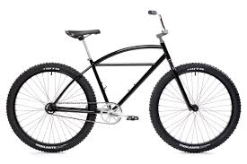
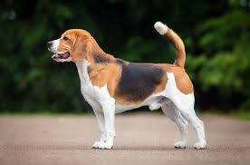
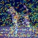

# Deep Learning assignement

### Install dependencies
`pip install -r requirements.txt`

### To run webapp
`stream run app.py`

### Analysis

| Image A – Bicycle | Image B – Dog |
|------------------|---------------|
|  |  |
|  |  |

In the shallow layer (layer1), the activations mainly respond to low-level features such as edges and textures. For the bicycle image, these activations highlight circular and linear structures corresponding to wheels and frame elements, while for the dog image they are more diffuse and texture-like, reflecting fur and background detail. The Grad-CAM visualizations at this layer appear noisy and less focused, which is expected since early layers are not strongly class-specific.